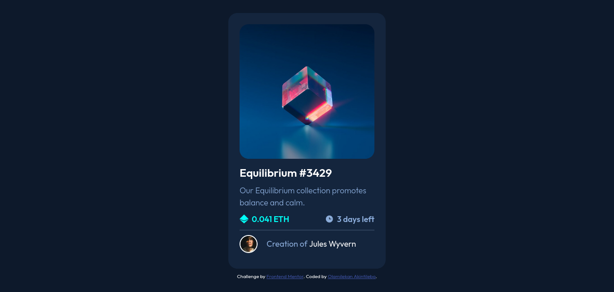

# Frontend Mentor - NFT preview card component solution

This is a solution to the [NFT preview card component challenge on Frontend Mentor](https://www.frontendmentor.io/challenges/nft-preview-card-component-SbdUL_w0U). Frontend Mentor challenges help you improve your coding skills by building realistic projects. 

## Table of contents

- [Frontend Mentor - NFT preview card component solution](#frontend-mentor---nft-preview-card-component-solution)
  - [Table of contents](#table-of-contents)
  - [Overview](#overview)
    - [The challenge](#the-challenge)
    - [Screenshot](#screenshot)
    - [Links](#links)
  - [My process](#my-process)
    - [Built with](#built-with)
    - [What I learned](#what-i-learned)
    - [Continued development](#continued-development)
  - [Author](#author)

## Overview

### The challenge

Users should be able to:

- View the optimal layout depending on their device's screen size
- See hover states for interactive elements

### Screenshot

### Links

- Solution URL: [Solution URL](https://github.com/hayohtee/nft-preview-card-component)
- Live Site URL: [Live Site URL](https://hayohtee.github.io/nft-preview-card-component/)

## My process

### Built with

- Semantic HTML5 markup
- CSS custom properties
- Flexbox
- Mobile-first workflow

### What I learned

I learned about CSS cascade rules and best practices
### Continued development

I want to explore the following areas for my continuous development:

- CSS Grid
- Responsive layout

## Author

- Github - [Olamilekan Akintilebo](https://github.com/hayohtee)
- Frontend Mentor - [@hayohtee](https://www.frontendmentor.io/profile/hayohtee)
- Twitter - [@hayohtee](https://www.twitter.com/hayohtee)
